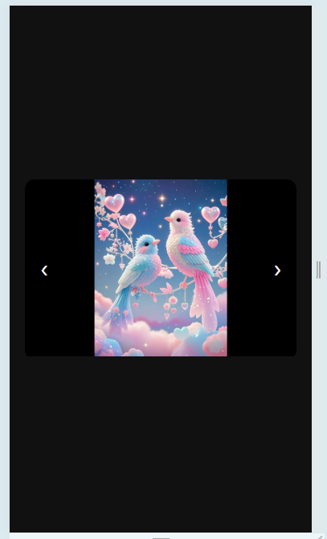

# Responsive Image Slider 🌐

A clean and fully responsive **image slider** built using **HTML, CSS, and JavaScript**.  
Designed to work smoothly on **desktop, tablet, and mobile devices**.

---

## 🚀 Features

- Fully responsive slider
- Smooth **click navigation** (prev/next buttons)
- **Swipe support** for mobile devices
- Clean and modern UI
- Cross-browser compatible

---

## 🛠️ Technologies Used

- HTML5
- CSS3
- JavaScript

---

## 📂 Project Use

- Portfolio websites
- Product showcases
- Photo galleries
- Fiverr / Client demos

---

## 📸 Preview

### 💻 Desktop View

### 📱 Tablet View

### 📲 Mobile View

---

## 📝 Project Notes

This project is a **modern and fully responsive image slider**.  
It works smoothly on all devices with **interactive navigation buttons** and **mobile swipe gestures**.

### 🔹 How It Works

1. **Navigation Buttons:** Click on `<` or `>` buttons to move between slides.  
2. **Swipe Support:** On touch devices, swipe left or right to navigate.  
3. **Responsive Design:** The slider automatically adapts to desktop, tablet, and mobile widths.  

### 🔹 Responsive Design

- 💻 Desktop: Full-width slider (1200×765 recommended for screenshots)  
- 📱 Tablet: Adjusts to 768×1024 (portrait)  
- 📲 Mobile: Adjusts to 375×667  

### 🔹 How to Use

1. Open `index.html` in your browser.  
2. Use the **prev/next buttons** or swipe on mobile to navigate slides.  
3. To change images, replace files in the folder and update `` paths.  

---

## ⚡ Screenshot Instructions (for GitHub / Fiverr)

1. Open your page in **Chrome**.  
2. Press `F12` → **Toggle Device Toolbar (📱)**.  
3. Set device width/height:  
   - Desktop: 1200×765  
   - Tablet: 768×1024  
   - Mobile: 375×667  
4. Right-click → **Capture Screenshot**.  
5. Save screenshots in `screenshots/` folder.  

---

## 📄 License

This project is **open-source** and free to use for **learning, portfolio, or client demos**.
